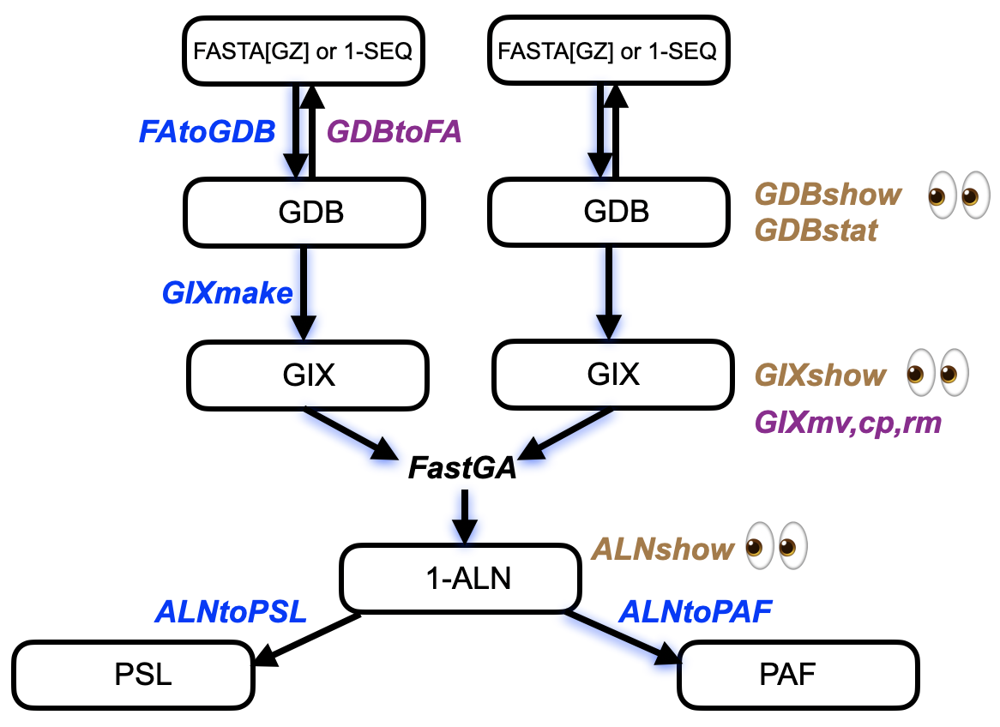

# FastGA: A Fast Genome Aligner
  
<font size ="4">**_Author:  Gene Myers_**<br>
**_First:   May 10, 2023_**<br>
**_Last:  Feb. 1, 2024_**<br>

- [FastGA](#FastGA) Compare two genomes or a genome against itself and output a .1aln, .paf, or .psl file of all alignments found.

- [Sub-Process Routines](#subprocess)
  - [FAtoGDB](#FAtoGDB): Convert a FASTA or ONEcode sequence file into a genome database (GDB)
  - [GIXmake](#GIXmake): Build a genome index (GIX) for a given GDB
  - [ALNtoPAF](#ALNtoPAF): Stream PAF formatted alignments for a given .1aln file
  - [ALNtoPSL](#ALNtoPSL): Stream PSL formatted alignments for a given .1aln file

- [Viewing Utilities](#viewing)
  - [GDBshow](#GDBshow): Display select contigs or substrings thereof from a GDB
  - [GDBstat](#GDBstat): Display various statistics and histograms of the scaffolds & contigs in a GDB
  - [GIXshow](#GIXshow): Display range of a GIX
  - [ALNshow](#ALNshow): Display selected alignments in a .1aln file in a variety of forms
  - [ALNplot](#ALNplot): Display alignments in a .1aln or .paf file in a static collinear plot

- [Additional Utilities](#addons)
  - [GDBtoFA](#GDBtoFA): Converts a GDB back to the FASTA or ONEcode sequence file it was derived from
  - [GIXrm](#GIXrm): Remove GDBs and GIXs including their hidden parts
  - [GIXcp](#GIXcp): Copy GDBs and GIXs including their hidden parts as an ensemble
  - [GIXmv](#GIXmv): Move GDBs and GIXs including their hidden parts as an ensemble
  - [ALNchain](#ALNchain): Alignment filtering by construction of local chains
  - [ALNreset](#ALNreset): Reset a .1aln file's internal references to the GDB(s) it was computed from
  - [PAFtoALN](#PAFtoALN): Convert a PAF formatted file with X-CIGAR strings to a .1aln file
  - [PAFtoPSL](#PAFtoPSL): Convert a PAF formatted file with X-CIGAR strings to a .psl file

## Overview

**FastGA** searches for all local DNA alignments between two high quality genomes.
The core assumption is that the genomes are nearly complete involving at most several
thousand contigs with a sequence quality of Q40 or better.
Based on a novel adaptive seed finding algorithm and the first wave-based local aligner developed for
[daligner (2012)](https://github.com/thegenemyers/DALIGNER), the tool can for example compare
two 2Gbp bat genomes finding almost all regions over 100bp that are 70% or more similar
in about 5.0 minutes wall clock time on my MacPro with 8 cores (about 28 CPU minutes).
Moreover, it uses a trace point concept to record all the found alignments in a compressed
and indexable [ONEcode](https://github.com/thegenemyers/ONEcode) file in a very space-efficient manner, e.g. just 44.5MB for over
635,000 local alignments in our running example.
These trace point encodings of the alignments can then be swiftly translated into .psl or .paf format on demand with programs provided here.

Using **FastGA** can be as simple as calling it with two FASTA files containing genome
assemblies where each entry is a scaffold with runs of N's separating and potentially giving the
estimated distance between the contigs thereof.  By default a PAF file encoding all the
local alignments found between the two genomes is streamed to the standard output.  In the
subdirectory ```EXAMPLE``` you will find a pair of sample input files, an output file, and a text file, ```sample_session``` capturing a session that serves to illustrate the use of FastGA.
Try it for yourself.

Under the surface, a number of intermediate steps take place.  First, the FASTA files
are converted to **genome databases** with extension **.1gdb** that are a [ONEcode](https://github.com/thegenemyers/ONEcode) binary file and associated hidden file containing the
ASCII DNA sequences in 2-bit compressed form.  This allows FastGA to randomly access contigs
and do so with four times less IO and no text parsing.  Second, a **genome index**
with extension **.gidx** is then built for each genome that is basically a truncated suffix array.
One of the things that makes FastGA fast is that it compares these two indices against
each other directly rather than looking up sequences of one genome in the index of the
other.
Third, FastGA records all the alignments it finds in a [ONEcode](https://github.com/thegenemyers/ONEcode) binary file we refer to here as a ALN-formated file with extension **.1aln** that uses a very space efficient trace point encoding of each alignment.  Finally in linear time, this trace point representation is converted into the desired PAF output.
Note carefully, that one has the option to keep the results in the very disk efficient ALN format, and then convert it to any of PAF, PSL, or other desired alignment format on demand.  The diagram immediately below summarizes and details the data flow just described.



While the entire set of blue shadowed processes can be fired off by simply calling FastGA, we
provide routines to perform each step under direct control (labeled in blue along dataflow arrows).
In addition we provide utilities labeled in brown that allow one to examine the intermediate
GDB, GIX, and ALN files.  An invocation of FastGA with the -k option or direct application of the sub-process routines, create persistent GDB and GIX entities that can be reused saving time if
a given genome is to be compared repeatedly.  The GDB and GIX items are actually an ensemble, consisting of a proxy file and a number of hidden
files.  So we provide the utilities GIXmv, GIXcp, and GIXrm to
manipulate these as an ensemble.  Finally, we provide the utility GDBtoFA that inverts
the process of converting a FASTA file into a GDB, providing the option of removing
all your fasta files, compressed or not, for the space efficient GDB representation.

FastGA features the use of the [ONEcode](https://github.com/thegenemyers/ONEcode) data encoding
framework with both its' GDB and ALN files that encode all the alignments found.  As such FastGA also
supports as input ONEcode sequence files that encode a genome, in addition to the usual
Fasta format.  So both FAtoGDB and GDBtoFA (despite their names) also recognize and support
ONEcode SEQ files as well as FASTA.

There are three conventions for all the tools in this package designed for your convenience.
First, suffix extensions need not be given for arguments of a known set of types.  For example,
if an argument is a fasta with root name "foo" without extensions, then
our commands will look for ```foo.fa,``` ```foo.fna,``` ```foo.fasta,```
 ```foo.fa.gz,``` ```foo.fna.gz,``` ```foo.fasta.gz``` if you specify
```foo``` as the argument.  Second, optional arguments (those that begin with a -) can
be in any order and in any position relative to the non-optional primary arguments (which must
be given in the order specified).  We find this convenient when for example you
have typed out an entire FastGA command but forgot that you wanted PSL output instead
of the default PAF output.
All you do is append -psl to what you've already typed and then hit return.  So for example,
```FastGA -v Asm1 -T16 Asm2 -psl``` is an acceptable command line.  Finally, if a -v option
is specified for a command then it always means "verbose mode", i.e. output to the standard
error a running discourse of the command's progress.

<a name="FastGA"></a>

## FastGA Reference

```
FastGA [-vk] [-T<int(8)>] [-P<dir($TMPDIR)] [<format(-paf)>]
          [-f<int(10)>] [-c<int(85)>] [-s<int(1000)>] [-l<int(100)>] [-i<float(.7)>]
          <source1:path>[<precursor] [<source2:path>[<precursor>]]
          
    <format> = -paf[mx] | -psl | -1:<alignment:path>[.1aln] 
        
    <precursor> = .gix | .1gdb | <fa_extn> | <1_extn>
    
    <fa_extn> = (.fa|.fna|.fasta)[.gz]
    <1_extn>  = any valid 1-code sequence file type
```

Performing a FastGA comparison can be as simple as issuing the command ```FastGA A B``` where A and B are FASTA, gzip'd FASTA, or ONEcode sequence files.  By default 8 threads will be used but this can be changed with the -T
parameter.  By default the myriad temporary files produced by FastGA are located in the directory given
by the environment varialble ```TMPDIR``` (or ```.``` if it is undefined) but this directory
can be changed with the -P option.  All the alignments found by FastGA are streamed to the standard output
and by default will be in PAF format.  You can change this to PSL, or ONEcode ALN formatted output with
the -psl and -1, options, respectively.
Note carefully however, that the ONEcode -1 option produces binary output and the output is stored at the path given with the option, and is not streamed to the standard output.
The -paf option can further be modulated with an 'x' or 'm', e.g. -pafx, which further requests that CIGAR
strings detailing the alignments be output (see [ALNtoPAF](#ALNtoPAF) below).

You can also call FastGA on a single source, e.g. ```FastGA A```, in which case FastGA compares A against
itself, carefully avoiding self matches.  This is useful for detecting repetititve regions of a
genome (and their degree of repetitiveness), and for finding homologous regions between haplotypes in an unphased genome assembly, or one that is phased but not split into separate haplotype files.

The one or two source arguments to FastGA can be either a FASTA file, a ONEcode sequence file (e.g. .1seq), a precomputed genome database
(GDB), or a precomputed genome index (GIX).  FastGA determines this by looking at the extension of
the argument if it is given explicitly, or if only the "root" name is given then it looks first for
a GIX with extenxion .gix, then a GDB with extension .1gdb, then a fasta file with one of
the extensions .fa, .fna, .fasta, .fa.gz, .fna.gz, or .fasta.gz, and if all else fails then FastGA
tries to open the file as a ONEcode (sequence) file.  If a GIX is not present then FastGA
makes one, and if in turn a GDB is not present than one is made.  The objects so made are removed
upon completion of the execution of FastGA unless the -k option is set in which case they are kept.
Note carefully, any object already in the file system is not affected.  We recommend that one *replace*,
using [FAtoGDB](#FAtoGDB), every FASTA file with its GDB, as the GDB occupies less disk space and its originating FASTA can be reproduced exactly with [GDBtoFA](#GDBtoFA) on demand.
Similarly, if a group of genomes will be compared against each other, we recommend that one build a
GIX for each beforehand with [GIXmake](#GIXmake).  It takes about 30seconds per gigabase to build a GIX,
so building
them prospectively saves time as FastGA need not do so every time it is called on the same genome.
On the other hand, GIXs are large, occupying 14GB for every gigabase of a genome, so we recommend that
one should build these as a prelude to a series of FastGA invocations and then remove them (but not
their GDBs) afterwards with [GIXrm](#GIXrm).

All the other options control the alignment discovery process.  Generally the defaults are fine and you
shouldn't bother touching these dials unless you are curious or confident.  For those willing to go further
FastGA uses the indices to find adaptive seed hits, where an
**adaptive seed** at a given position p of source1, is the longest string beginning at that position that is also somewhere in source2.  If the number of
occurences of this string in source2 is greater than the -f option, default value 10, then the
adaptamer is deemed *repetitive* and is not considered.  Otherwise **adpatamer seed hits** occur
at (p,q) for each q in  source2 where the adaptamer at p also occurs.
If GIXmake is invoked separately to make the index in advance of calling FastGA,
then the option -f, if specified,
must be less than or equal to the value of -f given when GIXmake was run.

FastGA then searches for runs or chains of adaptamer seed hits that (a) all lie within a diagonal band of width 128, (b) the spacing between every pair of consecutive seeds is less than -s(1000), and
(c) the seeds in the chain cover at least -c(85) bases in both genomes.  For these **chain
hits**, FastGA then runs a wave-based local alignment routine that searches for a local alignment
of length at least -l(100)bp with a similarity of -i(70%) or better that contains at least one
of the seeds in the chain.  All such found alignments are recorded as a trace-point encoding in
lexicographical order of source1 contig #, and then the source2 contig #, and then the start
coordinate of the alignment in source1.  The options -s, -c -l, and -i can be used to modify the default
thresholds for chaining and alignment just described.

<a name="subprocess"></a>

## Sub-Process Routines

<a name="FAtoGDB"></a>

```
1. FAtoGDB [-v] [-n<int>] <source:path>(.1seq|[<fa_extn>|<1_extn>]) [<target:path>[.1gdb]]

       <fa_extn> = (.fa|.fna|.fasta)[.gz]
       <1_extn>  = any valid 1-code sequence file type
```

FAtoGDB takes as input a FASTA file with extension .fa, .fna, .fasta, .fa.gz, .fna.gz, or .fasta.gz,
or a ONEcode sequence file (e.g. with extension .1seq)
and produces a **genome database** or GDB with extension .1gdb.
The name and location of the resulting GDB is determined as follows:

* If only a source file is given, then the GDB is built in the same directory and with the same core name as the FASTA file.

* If a target path is given and it is a directory, then the GDB is built in the given directory with the same core name as the FASTA file.

* If the target path is given and it is to a file name (that may not exist) then the directory and core name of the GDB are as for this target path.

A few examples: ```FAtoGDB A.fa``` and ```FAtoGDB PATH/A.fna .``` both produce A.gdb in the current directory, ```FAtoGDB PATH/A.fa.gz BLUE/AG.gdb``` produces AG.gdb in the directory BLUE (which must
exist).

The GDB actually consists of two files.  The first, *visible* file, is a ONEcode binary file with extension
.1gdb that contains all the information about an assembly except for the base-pair sequences which
are kept in a separate hidden file in 2-bit compressed format.  If the visible file has name say,
```foo.1gdb``` then this hidden file has name ```.foo.bps```.  We split the GDB this way as many application do not actually need the sequence, but simply need the sizes of contigs, gaps, & scaffolds and their names which are kept in the "light-weight" .1gdb portion.

For assemblies in FASTA files that contain n's as an undetermined base


<a name="GIXmake"></a>

```
2. GIXmake [-v] [-T<int(8)>] [-P<dir($TMPDIR>] [-k<int(40)>] [-f<int(10)>]
            ( <source:path>[.1gdb]  |  <source:path>[<fa_extn>|<1_extn>] [<target:path>[.gix]] )
            
       <fa_extn> = (.fa|.fna|.fasta)[.gz]
       <1_extn>  = any valid 1-code sequence file type
```

Given a source FASTA, ONEcode, or GDB file, GIXmake produces a **genome index** or GIX of the source with extension
.gix, creating the intermediate GDB if needed.
The name of the .gix is determined exactly as for FAtoGDB immediately above, save that
you are not allowed to create a GIX with a different core name and location than the GDB
it is derived from.  So note that in the summary command line syntax above you cannot specify
a target if the source is a GDB, you can only do so if one is starting from a FASTA file in which
both the GDB and GIX are created as per the target directive (if present).

The -T option can be used to specify the number of threads to use, where the default is 8.
The -P option similarly allows one to override the default directory given by the environmnt variable
```TMPDIR``` (or ```.``` if it is undefined), as the directory where the
(quite large and numerous) temporary files produced by GIXmake are held during its execution.
When running on an
HPC cluster node it is very important that this directory be on the disk local to the node
running the command.

The genome index basically consists of two parts: (1) a sorted table of the k-mers (k=40 by default) in the underlying genome that occur -f or fewer times (f=10 by default) along with the number of occurrences,
and (2) a list of all the positions in the genome that have a k-mer in the table, in the order in
which their k-mers occur in the table.  The .gix file is actually just a proxy for an ensemble
of -T hidden files with the extension .ktab.\<int\> that contain the k-mer table, and -T hidden files with
the extension .post.\<int\> that contain the position list.  Altogether these files occupy about 13-14GB
per gigabase of the genome and so a GIX is quite large.  Due to this structure we strongly recommend
that when you want to delete, copy, or move a GIX and its GDB, that rather than doing it piecemeal by
hand, you use the utilities [GIXrm](#GIXrm), [GIXcp](#GIXcp), [GIXmv](#GIXmv) that will handle not only
the proxy .gix file, but also the entire ensemble of hidden files as a single entity.

While you can reset the k-mer size with the -k option we
strongly suggest you use the default value of 40 or at least use a bigger value which will cost
you more compute time.  The option -f is designed to
remove k-mers from repetitive regions of the genome: only k-mers that occur -f or fewer times
are kept in the index.  The default value of -f is 10 and again we strongly suggest you use
this default.  Increasing it will improve sensitivity at the expense of more time and space,
decreasing it, the converse.  The effect is quadratic in -f so take care.

<a name="ALNtoPAF"></a>

```
3. ALNtoPAF [-mx] [-T<int(8)>] <alignments:path>[.1aln]
```

ALNtoPAF converts a ALN file into a [PAF](https://github.com/lh3/miniasm/blob/master/PAF.md) file, streaming the PAF to the standard output.
ALNtoPAF uses 8 threads by default, but this can be changed with the -T option.

The command must have access to the one or two GDB's from which the ALN file was derived.
So the path, both relative and absolute, of these is recorded within the ALN file at the time
it is created.  So one should be careful not to move or rename these GDBs, the one exception being
if you move them so that when you call ALNtoPAF they are at the same relative location from the
current directory as was true at the time of creation.
If you do have to rename or otherwise move the GDBs, then you can change the ALN file's internal
references to the new GDB locations with [ALNreset](#ALNreset).

In addition to the standard PAF fields, ALNtoPAF outputs a ```dv:F:<fraction>``` SAM-tag that gives the divergences of the query from the target and a ```df:I:<diffs>``` SAM-tag that gives the number
of differences in an optimal alignment between the two intervals of the query and target.

The -m and -x options request ALNtoPAF to produce a CIGAR string tag of the form ```cg:Z:<cigar-string>``` that explicitly encodes an optimal alignment.  With the -m option, aligned characters regardless of whether they are equal or not are
encoded with an 'M'.  With the -x option, aligned *equal* characters are encoded with an '=' and
aligned *unequal* characters with an 'X'.

*Beware*, the -m and -x options increase the time taken by ALNtoPAF by a factor of 10 and the file size
by a factor of almost 100 !  The time taken can
be ameliorated somewhat by running ALNtoPAF with more threads, controllable with the -T option.

<a name="ALNtoPSL"></a>

```
4. ALNtoPSL [-T<int(8)>] <alignments:path>[.1aln]
```

ALNtoPSL converts a ALN file into a [PSL](https://www.ensembl.org/info/website/upload/psl.html) file,
streaming the PSL to the standard output.
ALNtoPSL uses 8 threads by default, but this can be changed with the -T option.

The command must have access to the one or two GDB's from which the ALN file was derived.
So the path, both relative and absolute, of these is recorded within the ALN file at the time
it is created.  So one should be careful not to move or rename these GDBs, the one exception being
if you move them so that when you call ALNtoPAF they are at the same relative location from the
current directory as was true at the time of creation.
If you do have to rename or otherwise move the GDBs, then you can change the ALN file's internal
references to the new GDB locations with [ALNreset](#ALNreset).

*Warning*, the PSL output is almost 15 times larger than the ALN file.

<a name="viewing"></a>

## Viewing Utilities

<a name="GDBshow"></a>

```
1. GDBshow [-hU] [-w<int(80)>] <source:path[.1gdb] [ <selection> | <FILE> ]

        <selection> = <range>[+-] [ , <range>[+-] ]*

           <range> = <object/position> [ - <object/position> ]  | @ | .

              <object/position> = @ <scaffold> [ . <contig>] [ : <position> ]
                                |                . <contig>  [ : <position> ]
                                |                                <position>
 
                 <scaffold> = # | <int> | <identifier>
                 <contig>   = # | <int>         
                 <position> = # | <int> [ . <int> ] [kMG]
```

GDBshow allows one to view a given set of scaffolds/contigs or portions thereof for the source GDB.
If the <nobr>-h</nobr> option is set then only the header lines are shown.  By default DNA sequence is lower-case,
80bp per row.  You can request upper-case with -U, and set the line width with -w.  If no arguments
besides the source GDB are given, then all the contigs of the GDB are output (in order).  If a file name follows, then GDB interprets each line of the file as a \<range> selection.  Otherwise the argument is
directly interpreted as a directive as to which scaffolds or contigs or parts thereof to display.
We explain the syntax of a \<selection> above in a bottom up fashion coupled with examples:

* @s denotes the s'th scaffold in the genome, @# the last scaffold in the genome, and @id the scaffold
whose fasta header is id.  In this latter case the header is the part of the faster header line excluding
the '>' in the first column and any white space directly following it, and excluding any tailing white space.

* .c denotes the c'th scaffold in the genome, and .# the last contig. @s.c denotes the c'th contig of the s'th scaffold, so by extension, @s.# denotes the last contig of the s'th scaffold, @#.1 denotes the 1'st contig of the last scaffold, and so on.

* An integer p denotes an absolute position within the genome viewing it as the concatenation of its scaffolds -- not very useful generally.  But .c:p denotes the position p in the c'th contig, @s:p the
position p in the s'th scaffold, .c:# the last position in the c'th contig, @s.c:p the position p in
the c'th contig of the s'th scaffold, and so on.

* A position is considered to be a location *between* base pairs, so the first position is 0, and in general position i is the spot between the i'th and i+1'st base pairs.  In this way the number of symbols
 between position p and q > p is q-p.  Also, the last position is the length of the sequence.
 
* We support a more elaborate syntax for positions where the suffix symbols k, M, and G denote kilobases,
megabases, and gigabases and a decimal fraction is permited.  So for example, 10.1k is short for
positions 10,100, and 2.0324M is position 2,032,400.

* A range can be a reference to a contig or scaffold in which case the entire contig or scaffold is
 being selected.  It can also be a pair of contigs or scaffolds separated by a hyphen (-) in which case all the objects from the first to the last are being selected.  For example, @3-@5 would cause GDBshow to display the 3'rd through 5'th scaffolds inclusive and .3-.5 would display the 3'rd through 5'th contigs
 of the genome.  A range can also be a position or a pair of positions separated by a hyphen.  In the
 first case the range is empty which is not useful for an app like GDBshow but as you'll see later it is usefule for
 an app like ALNshow that displays every alignment containing the position.  When a pair of positions is given then all the sequence between the pairs is selected.  For example, @1.3:10k-@1.5:20k selects all but
 the first 10kbp of the 3'rd contig of the first scaffold, all of it's 4'th contig, and the first 20k of it's 5'th contig.

* A range can be @ in which case every scaffold is selected, and it can be . in which case every contig is selected.  A genome can be considered to be a list of its' contig sequences, or a list of its' scaffold sequences each of which is its' contigs concatenated together with intervening runs of N's denoting the gap (and possibly length) between them.  If a range involves an @-sign, that is, a scaffold index, then the selection is over scaffold sequences, otherwise it is over contig sequences.

* The second component of a range when present, is assumed to have the same scaffold or contig prefix
if it is not given.  For example, the expression @1.3:10k-.5:20k is the same as @1.3:10k-@1.5:20k and
@2:100-200 is the same as @2:100-@2:200.

* A range can be followed by an optional sign, + or -.  This indicates the selection of either the 5' or 3' direction of the selected sequence interval and can affects the direction of display.  For example, :3-
asks GDBshow to display reverse complement of the 3'rd contig of the genome.

* Lastly, on the command line, one can give a list of ranges separated by commas.  Generally this represents the union of the range intervals, but for GDBshow indicates that it should output each
range in the order given.  When a file is given, then each line of the file is assumed to be a
range so that the file also specifies a list of ranges.
 
<a name="GDBstat"></a>

```
2. GDBstat [-h[<ctg:int>,<scaf:int>]] [-hlog] <source:path[.1gdb]
```
GDBstat gives you summary statistics about the genome in the source GDB.  It always outputs the number,
cumulative base pairs, and average size of scaffolds, contigs, and gaps.  It also outputs the max, min,
and N<x> sizes for scaffolds and contigs, for <x> a multiple of 10.

If the -h option is specified then GDBstat also displays histograms of contig and scaffold sizes.
If the complete option is -hlog then GDBstat displays a histogram with logarithmically scaled
buckets, i.e. 1, 2, 5, 10, 20, 50, 100 ...
If two integers follow the -h then the first sets the histogram bucket size for the contig histogram
and the second for the scaffold histogram.  If nothing follows the -h then GDBstat picks a round
numbered bucket size so that each histogram has about 20 buckets (defined constant NBINS in GDBstat.c if you'd like to change that).

<a name="GIXshow"></a>

```
3. GIXshow <source:path[.gix] [ <address>[-<address>] ]

       <address> = <int> | <dna:string>
```

GIXshow displays all or a range of k-mers in a genome index along with the positions for each k-mer.
If an argument does not follow the source then the entire GIX is output starting with the smallest k-mer.
Otherwise the extra argument denotes a range of k-mers either as integer positions, e.g. the i'th k-mer
(in alphabetical order), or if a dna string is given it specifies the first k-mer whose prefix matches
the string (or the last if it is the second argument of a range).

<a name="ALNshow"></a>

```
4. ALNshow [-arU] [-i<int(4).] [-w<int(100)>] [-b<int(10)>>
              <alignments:path>[.1aln] [ <selection>|<FILE> [<selection>|<FILE>] ]

        <selection> = <range>[+-] [ , <range>[+-] ]*

           <range> = <object/position> [ - <object/position> ]  | @ | .

              <object/position> = @ <scaffold> [ . <contig>] [ : <position> ]
                                |                . <contig>  [ : <position> ]
                                |                                <position>
 
                 <scaffold> = # | <int> | <identifier>
                 <contig>   = # | <int>         
                 <position> = # | <int> [ . <int> ] [kMG]
```

ALNshow produces a printed listing of a subset of the local alignments contained in the specified
ALN file, where one can optionally view the alignments in a BLAST like format.  If just the ALN file is given
as an argument then every alignment is displayed.  If a single selection is given in addition, then only
those alignments whose interval in the 1st genome intersects the selection are displayed.
If a pair of selections are given then those alignments where its interval in the 1st genome intersects
the 1st selection and its interval in the 2nd genome intersects the 2nd selection are displayed.
If a range in the first selection is signed than that determines if the alignment is displayed with
the substring of the 1st genome in the normal orientation (+, also no sign) or the complement
orientation (-).  If a range in the second selection, if present, is signed than only alignments
in which the relative orientation of the first and second substrings agrees with the sign polarity
of the selection pair are displayed.
See the documentation for [GDBshow](#GDBshow) for a detailed explanation of the format and meaning
of selections.

The command must have access to the one or two source files from which the ALN file was derived.
This can be either a Fasta file, a ONEcode SEQ file, or a GDB depending on how the ALN file was created.
For example, if FastGA is run on two FASTA files without the -k option then the recorded sources
will be the FASTA file.  But with the -k option, then the GDB's (that are kept) are recorded.
The path, both relative and absolute, of these sources is recorded within the ALN file at the time
it is created.  So one should be careful not to move, rename, or remove the sources, the one exception being
if you move them so that when you call ALNshow they are at the same relative location from the
current directory as was true at the time of creation.
If you do have to rename or otherwise move the source files, then you can change the ALN file's internal references to their new locations with [ALNreset](#ALNreset).

If the -a or -r option is set then an alignment of the local alignment is displayed.
The -a option puts exactly -w columns per segment of the display, whereas the -r option
puts exactly -w a-read symbols in each segment of the display.  The -r display mode is
useful when one wants to visually compare two alignments involving the same a-read.
If both the -a, and -r flags are set, then the -a alignment comes first followed by the
-r alignment.  The -i option sets the indent for the alignment displays,
if they are requested.  The -b option sets the number of symbols on
either side of the aligned segments in an alignment display, and -U specifies that
uppercase should be used for DNA sequence instead of the default lowercase.

When examining ALNshow output it is important to keep in mind that the coordinates
describing an interval of a read are referring conceptually to positions between bases
starting at 0 for the position to the left of the first base.  That is, a coordinate c
refers to the position between the c'th and c+1'st base, and the interval [b,e] captures
the e-b bases from the b+1'st to the e'th, inclusive.  We give an example with
part of an alignment for which we will explain several additional features:

```
2.1 6.05c <0..3,110] x [162,039..158,933] ~ 6.18% (181,250,738 x 162,401,845 bps, 192 diffs, 32 trace pts)

             0 ..........ctaaccctaaccctaaccctaaccctaaccctaaccctaa
                         |||||||||||||||||||||||||||||||||**|||||
        162049 aaccctaaccctaaccctaaccctaaccctaaccctaacccta--cctaa   5.0%

            40 ccctaaccctaaccctaaccctaaccctaaccctaaccctaaccctaacc
               ||||||||||||||||||||||||||||||||||||||||||||||||||
        162001 ccctaaccctaaccctaaccctaaccctaaccctaaccctaaccctaacc   0.0%

            90 ctaaccctaaccctaaccctaaccctaaccctaaccctaaccctaaccct
               |||||||||||||||*||||||||||||||||||||||||||||||||||
        161951 ctaaccctaacccta-ccctaaccctaaccctaaccctaaccctaaccct   2.0%

           140 aaccctaaccctaaccctaaccctaaccctaaccctaaccctaaccctaa
               ||||||||||||||||||||||*|||||||||||||||||||||||||||
        161902 aaccctaaccctaaccctaacc-taaccctaaccctaaccctaaccctaa   2.0%

      . . . .
```

The display of a local alignment always begins with a line giving the A-scaffold & contig, then the B-scaffold & contig, then an indication of orientation (i.e. 'n' for same strand, and 'c' for the opposite
strand) followed by the A-interval and B-interval that are aligned in scaffold string coordinates
and then the % identify.  Then in parentheses follows
the lengths of the two scaffolds, the number of differences in the alignment, and the number of tracepoints used to encode the alignment between them.
In particular,
note carefully that when the B-item is in the complement orientation (c), then the
B-interval gives the higher coordinate first, the idea being that one will align from
the highest base down to the lowest base in the descending direction on B, complementing
the characters as you go.  Further note that in the alignment display the coordinates at
the start of each line follow this orientation convention and give the coordinate of the
"tick mark" just left of the first character in each line.  It is useful to know if an
interval reaches the beginning or end of a read, and to signal this we use an angle-bracket \<\> instead
of a square bracket [].

<a name="ALNplot"></a>

```
5. ALNplot [-vSL] [-T<int(4)>] [-p[:<output:path>[.pdf]]]
               [-a<int(100)>] [-e<float(0.7)>] [-n<int(100000)>]
               [-H<int(600)>] [-W<int>] [-f<int>] [-t<float>]
               <alignment:path>[.1aln|.paf[.gz]]> [<selection>|<FILE> [<selection>|<FILE>]]

        <selection> = <range>[+-] [ , <range>[+-] ]*

           <range> = <object/position> [ - <object/position> ]  | @ | .
            
              <object/position> = @ <scaffold> [ . <contig>] [ : <position> ]
                                |                . <contig>  [ : <position> ]
                                |                                <position>
 
                 <scaffold> = # | <int> | <identifier>
                 <contig>   = # | <int>         
                 <position> = # | <int> [ . <int> ] [kMG]
```

ALNplot produces a static collinear plot of the local alignments contained in the specified ALN file or PAF 
file in a EPS or PDF format file.  If just the ALN/PAF is given as an argument then every alignment is considered 
for plotting.  If a single selection is given in addition, then only those alignments whose interval in the 1st 
genome intersects the selection are considered. If a pair of selections are given then those alignments where 
its interval in the 1st genome intersects the 1st selection and its interval in the 2nd genome intersects the 2nd 
selection are considered. A selection can be comma-delimited to include multiple, interspersed ranges. These ranges
will be placed in order along the axis for plotting. The selection can also be a FILE, with each line representing 
a range. This is equivalent to concatenating all lines and separating them with commas. See the documentation 
for [GDBshow](#GDBshow) for a detailed explanation of the format and meaning of selections.

When the alignment input is an ALN file, the command must have access to the one or two source files from which 
the ALN file was derived. See [ALNshow](#ALNshow) for a detailed explanation.
When the alignment input is a PAF file, each sequence will be treated as a single contig, even if there are gaps. 
Consequently, selecting specific contigs is not possible in this case.

The default output is an EPS file sent to standard output. With the -p option, the output will be a PDF file, 
requiring a software ('[e]ps[to|2]pdf') to convert the EPS to PDF. You can specify the output PDF file name with 
the -p option; otherwise, the output file name will be determined by the input file name. 

You can use the -l and -i options to filter alignment records based on alignment length and identity. By default, 
only the longest 100,000 alignment records are used for plotting to maintain a manageable file size. This limit 
can be adjusted with the -n option, and setting it to 0 will include all alignments.

The program automatically adjusts the display of the output figure based on the input data. If these automatic 
settings are not suitable, you can use the options -S, -L, -H, -W, -f, and -t to manually configure the display 
parameters.

<a name="addons"></a>

## Additional Utilities

<a name="GDBtoFA"></a>

```
1. GDBtoFA [-vU] [-w<int(80)> <source:path>[.1gdb] [ @ | <target:path>[<fa_sten>|.1seq] ]

       <fa_extn> = (.fa|.fna|.fasta)[.gz]

```
GDBtoFA will produce exactly the FASTA file contents from which the source GDB was derived by
a call to FAtoGDB, or if so directed a ONEcode .1seq file, i.e. it is an inverse operation for
FAtoGDB.    When a GDB is built it records internally
where the source FASTA or ONEcode sequence file is, it's name, and it's extension.  We call this the "origin" in what
follows.  Where the FASTA file is placed by GDBtoFA and what it is named is as follows:

* If there is no target, then the output is streamed to the standard output (uncompressed).

* If the target is the special symbol @, then the FASTA file is built at it's origin directory and given it's origin name and extension (implying compression if it ends with .gz).

* If the target is a directory, then the FASTA file is built at said directory, it's name and extension are as for the origin.

* If the target is a file (that may not exist), then the FASTA file is built at the directory and named as given by the target.  If the target has an extension then that extension is used, otherwise the extension of the origin is used.


<a name="GIXrm"></a>
<a name="GIXcp"></a>
<a name="GIXmv"></a>

```
2.a GIXrm [-vifg] <source:path>[.gix|.1gdb] ...
2.b GIXmv [-vinf] <source:path>[.gix|.1gdb] <target:path>[.gix|.1gdb]
2.c GIXcp [-vinf] <source:path>[.gix|.1gdb] <target:path>[.gix|.1gdb]
```

A GDB consists of not only a "skeleton" file with a .1gdb extension but also a hidden file with extension .bps.
Likewise a GIX consists of not only a proxy file with a .gix extension but 2T hidden files with
extensions of the form .ktab.\<int\> and .post.\<int\> where T is the number of threads used to
create the index.
As such it is cumbersome to remove, move, or copy a GDB or GIX directly with the UNIX OS as it requires
you to utter 2T+3 commands or possibly only one if wild cards are used, albeit this has the potential for
surprising matches affecting unexpected files.
So we provide the commands GIXrm, GIXmv, and GIXcp to remove, move, or copy GDBs and/or GIXs as a
single entity.

The routines operate exactly as for rm, mv, and cp including the meaning/effect of the flags -v, -i, -n,
and -f.  For the GIXmv and GIXcp commands both the GIX and GDB are moved or copied, where just the
GDB will be affected if there is no associated GIX.  On the otherhand, for GIXrm only the GIX will be
deleted unless the -g flag is explicitly set in which case the GDB will also be removed.  We chose
this requirement as a safeguard because if you have replaced your FASTAs with the GDBs as we recommend,
then deleting the GDB is tantamount to deleting your genome source! 

<a name="ALNchain"></a>

```
3. ALNchain [-v] [-g<int(10000)>] [-l<int(10000)>] [-p<float(0.1)>] [-q<float(0.1)>]
                [-z<int(1000)>] [-s<int(10000)>] [-n<int(1)>] [-c<float(0.5)>] [-e<0.0>]
                [-f<int(1000)>] [-o<output:path>[.1aln]] <alignments:path>[.1aln]
```

For each pair of sequences, ALNchain generates a subset of alignments to achieve a one-to-one global alignment 
allowing rearrangements by selecting the best-scored local chains, adhering to user-specified constraints. 
We use a linear gap penalty for chaining, where the cost of a gap or overlap between consecutive alignments in 
the chain is defined by -p or -q. The maximum sizes of gaps and overlaps allowed in the chain can be adjusted 
using the -g and -l options. Chains are scored as *C-G\*p-O\*q*, where *C* represents the total number of unique 
sequence positions covered by the alignments. A chain is terminated if its score drops by more than -z.

Chains are selected based on their scores, from highest to lowest. The -s and -n options specify the minimum 
requirements for a chain to be considered. We track the sequence positions covered by all selected chains. For 
any new chain, the number of additional positions it covers on the sequences is calculated. If this number is 
below certain thresholds, determined by -c as a fraction of the chain size and -e as a fraction of the sequence 
size, the chain is not selected. When calculating the sequence positions covered by chains, the -f option is used 
as the upper limit for closing gaps.

<a name="ALNreset"></a>

```
4. ALNreset [-T<int(8)>] <alignments:path>[.1aln]
                 <source1:path>[.1gdb|<fa_extn>|<1_extn>] [<source2:path>[.1gdb|<fa_extn>|<1_extn>]]
                                     
       <fa_extn> = (.fa|.fna|.fasta)[.gz]
       <1_extn>  = any valid 1-code sequence file type
```

In the unfortunate event that the internal references of a 1-code alignment file (.1aln) to its genome source files have become
"stale", ALNreset allows you to reset these paths within the given file.  Note carefully, that the references can be not only to a GDB but also the source 1-code or FASTA files from which a GDB can be
built.

<a name="PAFtoALN"></a>

```
5. PAFtoALN [-T<int(8)>] <alignments:path>[.paf]
                         <source1:path>[.gdb|<fa_extn>|<1_extn>] [<source2:path>[.gdb|<fa_extn>|<1_extn>]]
                                     
       <fa_extn> = (.fa|.fna|.fasta)[.gz]
       <1_extn>  = any valid 1-code sequence file type
```

PAFtoALN takes a PAF file as its first argument and the two sources that were compared to produce the
alignment in the PAF file as the second and third arguments.
The PAF file must have CIGAR strings that use X and = to describe the alignment of ungapped segments
as opposed to just M.
The number of threads used is 8 by default, but can be set with the -T option.
A .1aln file with the name \<alignments\>.1aln is produced.  (*NB*: CIGAR strings with M could be
accepted but would require the explicit reconstruction of each alignment, a possible to do if
requested/required.)

<a name="PAFtoPSL"></a>

```
6. PAFtoPSL [-T<int(8)>] [-C<str(cg:Z:)>] <alignments:path>[.paf]
```

PAFtoPSL takes an uncompressed PAF file as input. The input file must include CIGAR strings. Supported CIGAR operators include 'M', '=', 'X', 'I', and 'D'. By default, the CIGAR string tag is 'cg:Z:', but you can 
specify a different tag using the '-C' option. The custom tag must be a five-character string where the third 
and fifth characters are ':'. The number of threads used is 8 by default, but can be set with the -T option.
Output is streamed directly to STDOUT.
